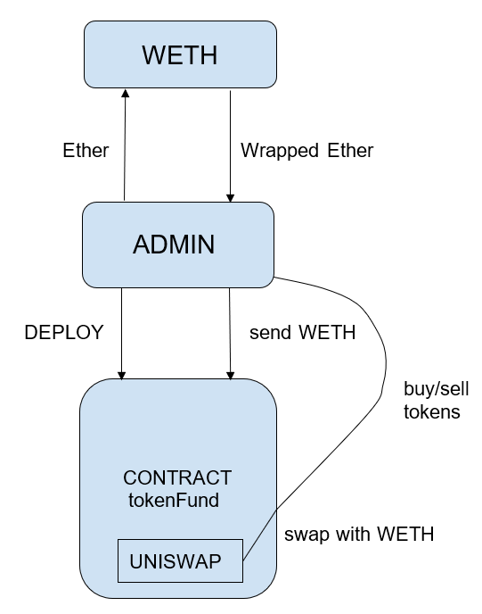
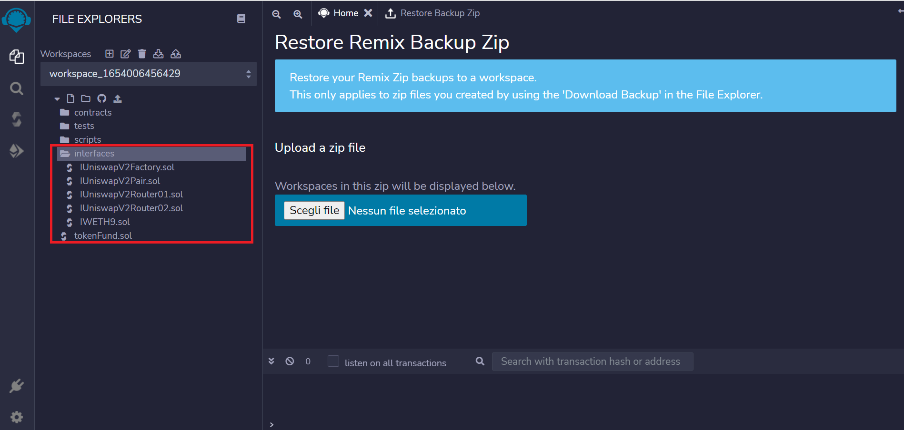
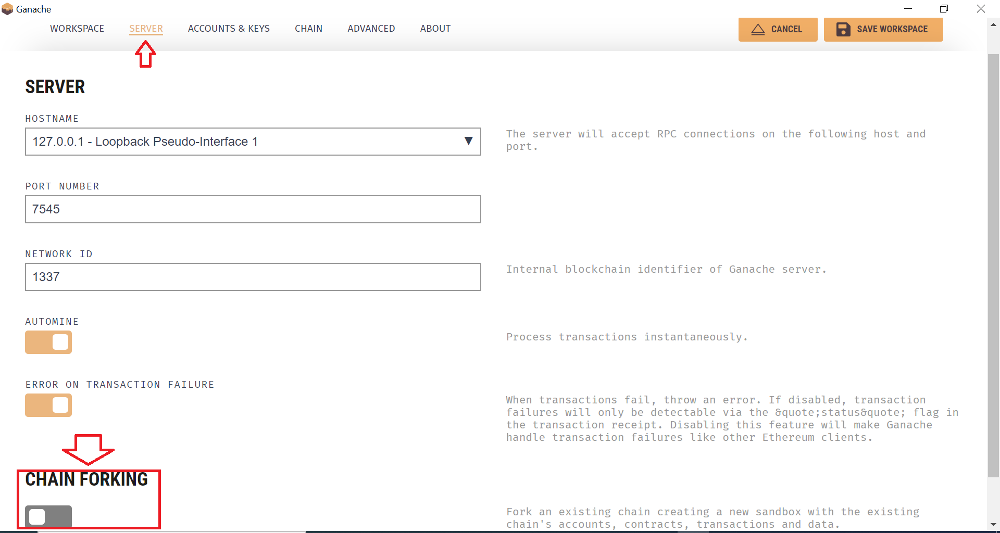

# prt_3_team5

# Tokenized Crypto Fund

## Introduction

The aim of this project is to have a tokenized crypto fund that can be owned by users with an Ethereum account. The fund will have an administrator which decides to mint share to a users, keeps liquidity of held underlying in equilibrium, adds and remove tokens from the fund. 
To create the shares of the fund, the underlying assets will be bought on Uniswap, which allows to have access to market pairs on a decentralized Exchange (DEX).

## Technology

- [Standard ERC20](https://docs.openzeppelin.com/contracts/4.x/erc20) since we want our tokenized fund share to be fungible, me make it compliant to this standard
- [Ownable contract](https://docs.openzeppelin.com/contracts/2.x/access-control) so we have power over access control
- [SafeMath](https://docs.openzeppelin.com/contracts/2.x/api/math) to perform sound mathematical operation because we are operating with unsigned integers only
- [Uniswap](https://docs.uniswap.org/) to give us access to an automated market maker, liquidity pools and pairs
- [Ganache](https://trufflesuite.com/ganache/) to create a dummy blockchain on which to test our contract
- [Remix](https://remix.ethereum.org/) as a compiler and to deploy compiled smart contracts

## Walkthrough

  

We will have an admnistrator, who wll be the deployer of the contract. This administrator interacts with the WETH contract to swap ETH with WETH, in order to be able to purchase tokens on the Uniswap exchange and add them to the fund, by calling the functions of the contract. The administrator can also sell the tokens, swapping them with WETH.  

### Idea

An investor who wants to own some shares of this fund shall send the amount he wants to buy in ETH to the administrator. The administrator will take care of minting new shares at his address and use the money received to balance the liquidity in his fund, by buying the required amount of tokens already held by the fund on the market.  
An investor can decide at any time to liquidate his position, so all the tokens relevant to his shares will be sold on the Uniswap market and he will be paid off in WETH.

### Functions

- `getTokens` returns the tokens held by the fund
- `getShare` can be called by users to see how big are their holdings respect the total supply of the fund (returns the result in perthousand)
- `removeToken` liquidates the desired asset swapping it with WETH
- `addToken` adds the desired amount of a token by purchasing it with WETH
- `retireInvestment` allows an user to retire his investment, payed off in WETH
- `mint` can be called by the administrator only to create new shares of the fund to an user's address

## Usage

To use this contract clone locally the present repository, then upload the files cointained in the folder `interfaces` and the `tokenFund.sol` on Remix keeping the same directory type in the workspace.
Once you correctly loaded the files in the Remix IDE you should see the interface like the following image

Now navigate to your Solidity compiler and compile the contracts `tokenFund.sol` and `IWETH9.sol`. After compilation we will deploy our contract on a local forked Ethereum network using Ganache as environment. To do this open the Ganache application and click on "New Workspace", and keep the "Ethereum" option. 
Name the environment as you prefer, then click on "SERVER" and enable "Chain Forking" (see picture below).

In the box that appears for the custom URL paste the following: https://eth-mainnet.alchemyapi.io/v2/d0Mum9ebnl87zfKOwALWsex9b7o-dGuI; in this way we'll fork the Etherum mainnet. Save the workspace and the local blockchain will be ready.
Next go back on Remix and click on "Deploy and run transaction" button, and as environment choose "Ganache Provider", then past the URL you can see under "RPC server" in your Ganache application (you will see that the first account matches the one in Ganache, at which we will deploy our contract, meaning it will be the administrator).
To finalize before deployment select the contract `tokenFund.sol` and give the name and symbol of your choice. Since we want to deploy the contract on Uniswap, as `_amm` address insert `0x7a250d5630b4cf539739df2c5dacb4c659f2488d`. After these insertions you can click on transact and wait for your contract to be deployed.  
Since Uniswap uses WETH (Wrapped Ether) which is an ERC20 compliant token pegged to ETH, we'll use the `IWETH9.sol` contract to swap ETH with WETH; to do so select this contract in the Remix deploy interface, insert next to the `atAddress` button the WETH contract address `0xc02aaa39b223fe8d0a0e5c4f27ead9083c756cc2`, then click on the button. Once the contract is loaded you can insert the amount of Ether you want to send (i.e. swap with WETH) and click on `deposit`. After this under `deposit`, you can use the function `transfer` to send the wanted amount of WETH to the tokenized fund contract, by inserting the desired amount and the address of the doployed `tokenFund` contract.

## License

Copyright 2022 - Antonio Parolini, Edgar Pocaterra, Maxwell Snyder, Meina Bian, Michael Adut

Permission is hereby granted, free of charge, to any person obtaining a copy of this software and associated documentation files (the "Software"), to deal in the Software without restriction, including without limitation the rights to use, copy, modify, merge, publish, distribute, sublicense, and/or sell copies of the Software, and to permit persons to whom the Software is furnished to do so, subject to the following conditions:

The above copyright notice and this permission notice shall be included in all copies or substantial portions of the Software.

THE SOFTWARE IS PROVIDED "AS IS", WITHOUT WARRANTY OF ANY KIND, EXPRESS OR IMPLIED, INCLUDING BUT NOT LIMITED TO THE WARRANTIES OF MERCHANTABILITY, FITNESS FOR A PARTICULAR PURPOSE AND NONINFRINGEMENT. IN NO EVENT SHALL THE AUTHORS OR COPYRIGHT HOLDERS BE LIABLE FOR ANY CLAIM, DAMAGES OR OTHER LIABILITY, WHETHER IN AN ACTION OF CONTRACT, TORT OR OTHERWISE, ARISING FROM, OUT OF OR IN CONNECTION WITH THE SOFTWARE OR THE USE OR OTHER DEALINGS IN THE SOFTWARE.
