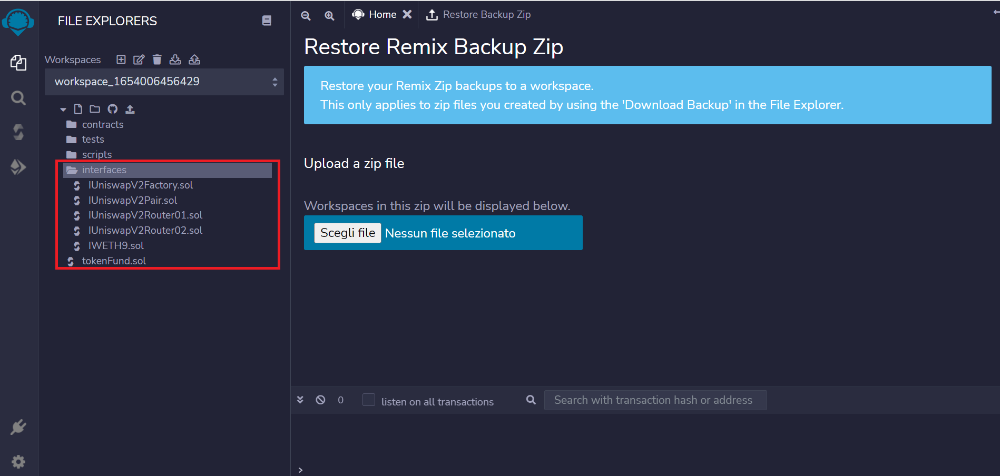
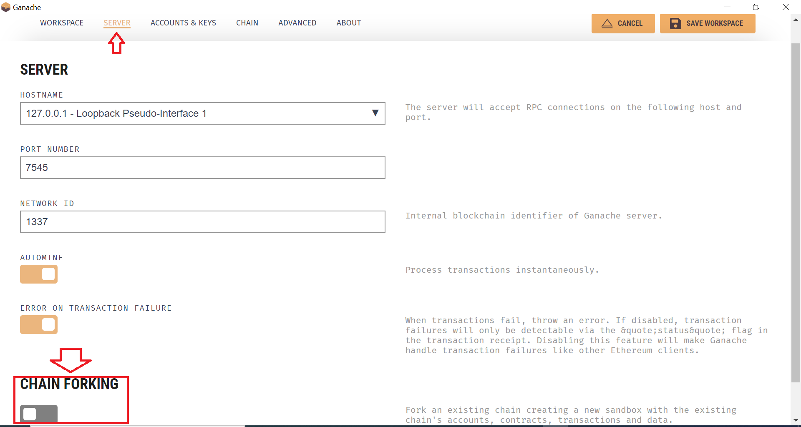

# prt_3_team5

# Tokenized Asset Fund

## Introduction

## Technology

- [Standard ERC20](https://docs.openzeppelin.com/contracts/4.x/erc20) since we want our tokenized fund share to be fungible, me make it compliant to this standard
- [Ownable contract](https://docs.openzeppelin.com/contracts/2.x/access-control) so we have power over access control
- [SafeMath](https://docs.openzeppelin.com/contracts/2.x/api/math) to perform sound mathematical operation because we are operating with unsigned integers only
- [Uniswap](https://docs.uniswap.org/) to give us access to an automated market maker, liquidity pools and pairs
- [Ganache](https://trufflesuite.com/ganache/) to create a dummy blockchain on which to test our contract
- [Remix](https://remix.ethereum.org/) as a compiler and to deploy compiled smart contracts

## Walkthrough

## Usage

To use this contract clone locally the present repository, then upload the files cointained in the folder `interfaces` and the `tokenFund.sol` on Remix keeping the same directory type in the workspace.
Once you correctly loaded the files in the Remix IDE you should see the interface like the following image

Now navigate to your Solidity compiler and compile the contracts `tokenFund.sol` and `IWETH9.sol`. After compilation we will deploy our contract on a local forked Ethereum network using Ganache as environment. To do this open the Ganache application and click on "New Workspace", and keep the "Ethereum" option. 
Name the environment as you prefer, then click on "SERVER" and enable "Chain Forking" (see picture below).

In the box that appears for the custom URL paste the following: https://eth-mainnet.alchemyapi.io/v2/d0Mum9ebnl87zfKOwALWsex9b7o-dGuI; in this way we'll fork the Etherum mainnet. Save the workspace and the local blockchain will be ready.
Next go back on Remix and click on "Deply and run transaction" button, and as environment choose "Ganache Provider", then past the URL you can see under "RPC server" in your Ganache application (you will see that the first account matches the one in Ganache, at which we will deploy our contract, meaning it will be the administrator).
To finalize before deployment select the contract `tokenFund.sol` and give the name and symbol of your choice. Since we want to deploy the contract on Uniswap, as administrator address insert `0x7a250d5630b4cf539739df2c5dacb4c659f2488d`.

## License

Copyright 2022 - Antonio Parolini, Edgar Pocaterra, Maxwell Snyder, Meina Bian, Michael Adut

Permission is hereby granted, free of charge, to any person obtaining a copy of this software and associated documentation files (the "Software"), to deal in the Software without restriction, including without limitation the rights to use, copy, modify, merge, publish, distribute, sublicense, and/or sell copies of the Software, and to permit persons to whom the Software is furnished to do so, subject to the following conditions:

The above copyright notice and this permission notice shall be included in all copies or substantial portions of the Software.

THE SOFTWARE IS PROVIDED "AS IS", WITHOUT WARRANTY OF ANY KIND, EXPRESS OR IMPLIED, INCLUDING BUT NOT LIMITED TO THE WARRANTIES OF MERCHANTABILITY, FITNESS FOR A PARTICULAR PURPOSE AND NONINFRINGEMENT. IN NO EVENT SHALL THE AUTHORS OR COPYRIGHT HOLDERS BE LIABLE FOR ANY CLAIM, DAMAGES OR OTHER LIABILITY, WHETHER IN AN ACTION OF CONTRACT, TORT OR OTHERWISE, ARISING FROM, OUT OF OR IN CONNECTION WITH THE SOFTWARE OR THE USE OR OTHER DEALINGS IN THE SOFTWARE.